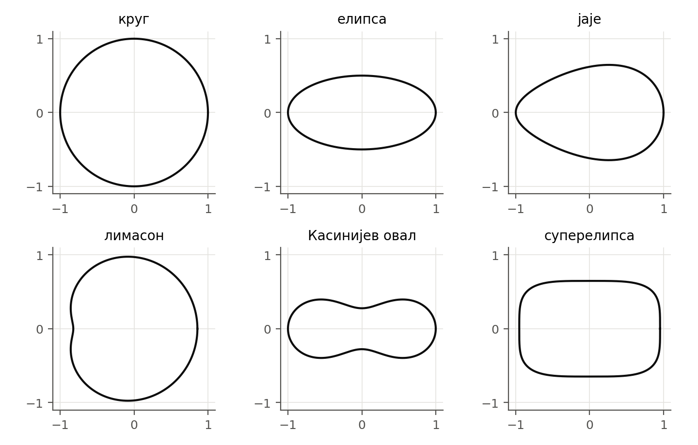
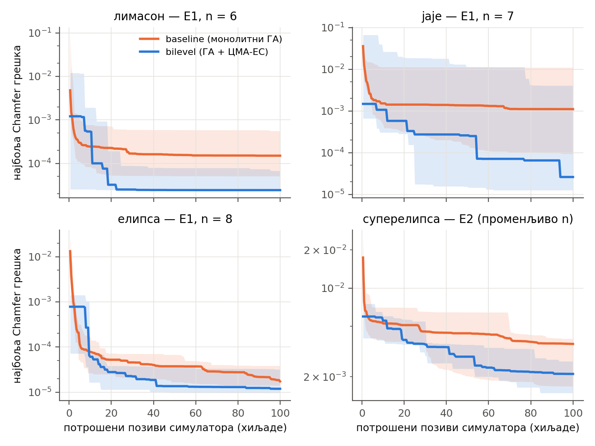
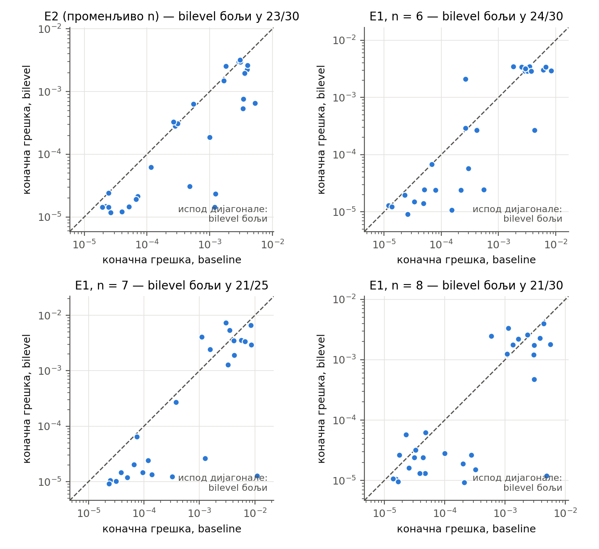
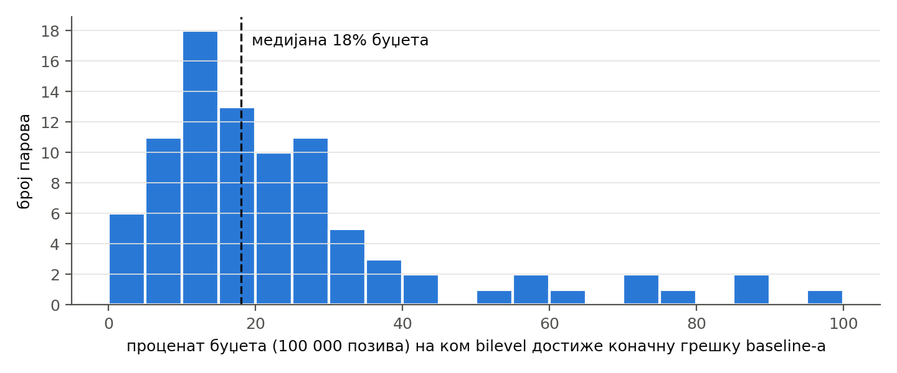

# Апстракт

Синтеза планарног механизма са полугама који својом спрежном тачком исцртава задату криву је мешовити оптимизациони проблем: дискретна топологија (који чвор је окачен о које) и континуална геометрија (положаји и дужине полуга) морају се тражити истовремено, а изводљивост решења зависи од обе. Ong, Shirakawa и Akimoto (2026) показали су на вештачким тест-функцијама да двонивовска декомпозиција — категорички део се оцењује тек пошто му се континуални део оптимизује — надмашује методе који обе врсте променљивих третирају заједно, кад међу њима постоји јака спрега. Овај рад проверава ту тврдњу на стварном инжењерском проблему и проширује је на простор механизама са променљивим бројем чворова, који њихов оквир не покрива. Механизам записујемо као секвенцу склапања, што при фиксном броју чворова $n$ даје тачно њихов облик проблема $\min f(c,x)$ са $d_c = 2(n-3)$ категоричких и $d_x = 2n-2$ континуалних променљивих. Поредимо монолитни генетски алгоритам (основни метод) са двонивовским методом у ком спољашњи генетски алгоритам претражује топологије, а унутрашњи ЦМА-ЕС геометрију. При истом буџету од 100 000 позива симулатора, на пет нетривијалних циљних кривих и четири поставке ($n = 6, 7, 8$ и променљиво $n$), укупно 115 упарених поређења, двонивовски метод даје нижу коначну Chamfer грешку у 89 парова (медијана односа грешака 0.57×, 95% интервал поверења 0.45–0.68×, Вилкоксонов упарени тест $p = 5.9\cdot10^{-11}$), и то у свакој од четири поставке засебно. Коначни резултат основног метода двонивовски достиже на медијално 18% буџета. Предност није плаћена лошијом физичком изводљивошћу решења. На две криве на којима оба метода при фиксном $n$ стају на исти под грешке предност нестаје; при променљивом $n$ двонивовски метод тај под делимично пробија повећањем броја радних чворова. Мерења Хесијана подржавају, али не доказују, да проблем припада класи у којој топологија мења метрику континуалног пејзажа (тип IV по таксономији Ong и сар.).

**Кључне речи:** синтеза механизама, пантограф, двонивовска оптимизација, генетски алгоритам, ЦМА-ЕС, мешовита оптимизација, Chamfer растојање

# 1. Увод

Механизам са полугама претвара равномерно окретање једне осовине у сложено кретање неке своје тачке. Најпознатији пример је нога Theo Jansen-овог *Strandbeest*-а (Jansen), до које је аутор стигао дугим ручно вођеним оптимизационим поступком. Питање које мотивише овај пројекат гласи: ако је задата произвољна затворена крива, може ли рачунар сам да пронађе механизам чија спрежна тачка (у даљем тексту: *трагач*) ту криву исцртава?

Проблем је тежак из три разлога. Прво, решење има две природе: **топологију** (колико има зглобова и о које је зглобове сваки окачен) и **геометрију** (где се зглобови налазе и колике су полуге). Друго, већина комбинација није изводљива — полуге се не могу склопити, механизам се заглави током окретања или пролази кроз мртву тачку. Треће, топологија и геометрија су јако спрегнуте: иста геометријска промена у једној топологији поправља путању, у другој је руши.

Класичан приступ синтези механизама користи еволутивне алгоритме над унапред фиксираном топологијом, најчешће четворополужјем (Cabrera и сар., 2002; Sleesongsom и Bureerat, 2018). Новији приступи засновани на подацима претражују велике унапред израчунате базе механизама (Nobari и сар., 2024; Tang и сар., 2026). Оба правца заобилазе истовремену претрагу топологије и геометрије — први је фиксира, други је своди на избор из базе.

Са стране оптимизације, проблем припада класи **мешовите оптимизације црне кутије**: тражи се $\min f(c, x)$, где је $c$ вектор категоричких променљивих без поретка, а $x$ реални вектор. Методи попут CatCMA (Hamano и сар., 2024) држе заједничку производ-расподелу над $c$ и $x$ и тиме претпостављају њихову независност. Ong, Shirakawa и Akimoto (2026) предлажу **информационо-геометријску двонивовску декомпозицију** (IGBD): свака категоричка конфигурација $c$ оцењује се тек пошто јој се континуални део делимично оптимизује,
$$
f^*(c) = \min_x f(c, x), \qquad \min_{q} \; \mathbb{E}_{c \sim \mathrm{Cat}(q)}\big[f^*(c)\big],
$$
и показују да тај приступ надмашује CatCMA и ICatCMA кад међу $c$ и $x$ постоји јака спрега. Своје тврдње мере на вештачким функцијама са бинарним категоричким променљивим и **фиксним** димензијама $d_c$ и $d_x$, и сами наводе да вишеопционе категоричке променљиве остају нетестиране.

Синтеза механизама са променљивим бројем зглобова природно излази из тог оквира: број чворова мења и $d_c$ и $d_x$. Овај рад има два циља:

1. **Провера** — показати да је синтеза пантографа при фиксном броју чворова дословна инстанца њихове формулације, и да двонивовска подела и на том стварном проблему доноси предност коју они тврде (експеримент Е1).
2. **Проширење** — показати да двонивовска подела са популацијским спољашњим нивоом ради и тамо где њихов оквир не важи, када се број чворова мења током претраге (експеримент Е2).

**Хипотеза (H1).** При истом буџету позива симулатора, двонивовски метод (генетски алгоритам над топологијом + ЦМА-ЕС над геометријом) даје нижу коначну грешку и/или бржу конвергенцију од монолитног генетског алгоритма који топологију и геометрију мења заједно.

# 2. Опис проблема

## 2.1. Механизам као граф

Механизам је граф $M = (V, E)$ са $n$ чворова (зглобова) и ивицама које су круте полуге. Улоге чворова одређене су индексом: чворови 0 и 1 су **непокретни** (закуцани за подлогу; чвор 0 је у координатном почетку), чвор 2 је **ручица** која се окреће око чвора 0 константном угаоном брзином, чвор $n-1$ је **трагач**, а остали су слободни. Механизам мора имати тачно један степен слободе. За раван систем крутих полуга са два непокретна зглоба то значи
$$
\mathrm{DOF} = 2(n-2) - |E| = 1 \quad\Longleftrightarrow\quad |E| = 2n - 5 .
$$

## 2.2. Секвенца склапања

Скуп ивица не каже *ко на кога виси*. Зато механизам записујемо као **секвенцу склапања**: језгро (чворови 0, 1, 2 са апсолутним координатама) и за сваки следећи чвор $k = 3, \dots, n-1$ ген
$$
g_k = \big(a_k,\; b_k,\; \rho^a_k,\; \rho^b_k,\; s_k\big),
$$
где су $a_k < b_k < k$ два већ постављена ослонца, $\rho^a_k$ и $\rho^b_k$ дужине двеју нових полуга изражене као однос према размаку ослонаца $D_k$ у почетном положају, а $s_k \in \{-1, +1\}$ бира једну од две тачке пресека кругова око ослонаца. Сваки чвор тако има тачно два суседа мањег индекса, па је редослед решавања увек $[3, 4, \dots, n-1]$ и запис је једнозначан. Свако додавање чвора уводи две координате и две полуге, па степен слободе остаје 1 за свако $n$.

Односи $\rho$ служе само за запис: при реконструкцији се једном претворе у апсолутне дужине $\ell = \rho\, D_k$, које од тада остају константне. Путања трагача зависи само од чворова из његовог **предачког стабла**; чворови ван њега (*мртав терет*) не утичу на путању, али остају у геному као материјал за касније мутације.

## 2.3. Симулација и изводљивост

Положај сваког чвора за угао ручице $\theta$ рачуна се пресеком два круга око његових ослонаца. Путања трагача узоркује се у $N = 720$ равномерних углова. Јединка је **неизводљива** ако у било ком углу: (1) кругови немају пресек; (2) **угао преноса** — угао између две полуге у зглобу — падне испод $10^\circ$ (близина мртве тачке; Balli и Chand, 2002); (3) однос најдуже полуге и полупречника путање пређе **гломазност** 5.0. Неизводљива јединка добија равну казну $10^9$.

Грана пресека $s_k$ одређује се једном, у $\theta = 0$, и важи на сваком углу. Прелазак на другу грану захтевао би пролаз кроз мртву тачку, коју праг угла преноса ионако одбија, па механизам не може да „скочи" на огледалску конфигурацију. Тиме је путања увек непрекидна по конструкцији.

## 2.4. Функција грешке

Циљна крива $T$ и генерисана путања $G$ нормализују се истом функцијом (центар обухватног правоугаоника у координатни почетак, највеће растојање од центра = 1), па грешка мери искључиво облик. Грешка је симетрично **Chamfer растојање**:
$$
d(G,T) = \frac{1}{N}\sum_{i=1}^{N}\min_j \lVert g_i - t_j\rVert^2 + \frac{1}{m}\sum_{j=1}^{m}\min_i \lVert t_j - g_i\rVert^2 .
$$
Симетричност спречава дегенерисана решења (путању сведену на део криве), а мера не зависи од смера ни брзине обиласка. На крају покретања најбољи механизам се сличносном трансформацијом поставља на место и у величину циљне криве.

## 2.5. Веза са формулацијом $\min f(c, x)$

За фиксно $n$ секвенца склапања се дословно раставља на категорички и континуални део:

- **$c$** — за сваки $k = 3, \dots, n-1$ две променљиве: неуређени пар ослонаца $(a_k, b_k)$ са $K_k = \binom{k}{2}$ опција и знак гране $s_k$ са две опције. Дакле $d_c = 2(n-3)$ и
$$
|\mathcal{C}| = \prod_{k=3}^{n-1} 2\binom{k}{2}.
$$
- **$x$** — $(q_{1x}, q_{1y}, q_{2x}, q_{2y}, \rho^a_3, \rho^b_3, \dots, \rho^a_{n-1}, \rho^b_{n-1}) \in \mathbb{R}^{2n-2}$, положаји чвора 1 и ручице и односи дужина полуга.

Table: Табела 1. Величина простора претраге при фиксном $n$.

| $n$ | $d_c$ | $d_x$ | $\lvert\mathcal{C}\rvert$ | највише опција по категоричкој променљивој |
|---|---|---|---|---|
| 6 | 6 | 10 | 1 440 | 10 |
| 7 | 8 | 12 | 43 200 | 15 |
| 8 | 10 | 14 | 1 814 400 | 21 |

Растављање је могуће **захваљујући секвенци склапања**. Са записом преко скупа ивица простор не би био производ појединачних избора и уклапање у формулацију $\min f(c,x)$ не би постојало. Континуални део има исту димензију $2n-2$ као и геном монолитног метода, па оба метода претражују простор исте величине.

# 3. Методе

## 3.1. Основни метод — монолитни генетски алгоритам

Основни метод (у даљем тексту **МГА**; у репозиторијуму *baseline*) мења топологију и геометрију заједно, у истом кораку. Популација има 100 јединки. Најбољих 20% прелази у следећу генерацију непромењено; осталих 80% настаје укрштањем (30% из пара најбољих 20%, 30% из мешовитог пара, 20% из пара средњих 20–80%). Укрштање сече секвенцу склапања на једном месту: дете добија језгро и почетак секвенце од првог родитеља, а крај од другог. Пошто сваки ген показује само уназад, дете је увек структурно исправно, а пошто су дужине записане као односи, пресађени крај се сам прилагоди размери новог језгра.

Новонастале јединке се мутирају: са вероватноћом 0.30 тополошки, са 0.70 координатно (независни догађаји). Координатна мутација додаје сваком чвору, са вероватноћом 0.25, изотропни Гаусов шум ширине $\sigma = k \cdot \bar\ell$, где је $\bar\ell$ просечна дужина полуге јединке, а $k$ експоненцијално опада од 0.15 до 0.02 са потрошеним буџетом.

Тополошки оператори при **променљивом** $n$ су `add_node` (нови чвор постаје трагач окачен о стари трагач, или се убацује као неутрална грана непосредно пре трагача) и `delete_node` (брише чвор и преспаја његове зависнике на његове ослонце); $n \in [4, 12]$. При **фиксном** $n$ ти оператори отпадају и замењује их **преповезивање**: изабраном чвору се или замени један ослонац (вероватноћа 0.70), или обрне знак гране (0.30). Ниједан оператор не мења улоге чворова нити крши правило „два суседа мањег индекса".

МГА мора бити најбољи могући, а не намерно ослабљен. Отуда и кеш оцена: непромењена елита на истој резолуцији се не оцењује поново и не троши буџет (одељак 3.4).

## 3.2. Двонивовски метод — ГА над топологијом, ЦМА-ЕС над геометријом

Двонивовски метод (у даљем тексту **ДН**; у репозиторијуму *bilevel*) цепа секвенцу склапања по формулацији из одељка 2.5.

**Спољашњи ниво** је генетски алгоритам са популацијом од 20 *скелета* $\{n, (a_k, b_k, s_k)_k\}$. У свакој генерацији најбоља четири (20%) прелазе даље **са својим живим стањем ЦМА-ЕС-а** и настављају оптимизацију, а 16 нових настаје тополошком мутацијом родитеља изабраног равномерно из горње половине. Укрштања нема. Тополошки оператори су исти као код МГА, са истим вероватноћама.

**Унутрашњи ниво** је ЦМА-ЕС (Hansen, 2016) над вектором $x$, са пуном коваријансном матрицом и подразумеваном величином популације $\lambda = 4 + \lfloor 3 \ln d\rfloor$. Број итерација по позиву није фиксан: ЦМА-ЕС се зауставља кад се најбоља вредност у последњих 10 итерација поправи мање од 1%, а највише после 200 итерација. Оцена скелета је најбоља вредност коју је ЦМА-ЕС нашао.

Три одлуке прилагођавају унутрашњи ниво проблему:

- **Мртви чворови не заузимају димензије.** У вектор $x$ улазе само $\rho$ чворова из предачког стабла трагача; остале се замрзавају. Димензија која не утиче на путању била би потпуно раван правац, а трошак ЦМА-ЕС-а расте са квадратом димензије.
- **Топлији почетак (warm-start).** Дете почиње од најбоље тачке родитеља, наслеђује дијагоналу родитељеве ширине расподеле по координатама које постоје и код родитеља, а нове координате добијају почетну ширину 0.3 (Nomura и сар., 2021 мотивишу исту идеју за ЦМА-ЕС уопште).
- **Знак гране је топологија, не геометрија.** $s_k$ се не налази у $x$; ЦМА-ЕС који би слободно померао координате могао би незапажено да пребаци чвор на другу грану.

## 3.3. Јединица трошка

Основна јединица трошка је **један позив симулатора** — једна оцена једног кандидата. Код МГА то је једна јединка; код ДН свака тачка коју ЦМА-ЕС узоркује, укључујући оне које падну већ на реконструкцији. Неизводљива тополошка мутација у ДН кошта један позив и не добија ЦМА-ЕС. Бројање је исто оно које користе Ong и сар. (2026), па је поређење директно у њиховој мери трошка.

## 3.4. Поставка експеримената

Сва покретања иду у **режиму поређења**: резолуција путање фиксно $N = 720$, буџет **100 000 позива** за оба метода, **без раног заустављања**, са записом најбоље грешке на решетки од 500 позива (крива грешка–позиви, једнака за оба метода). Кеш оцене елите код МГА је укључен и сваки пут пријављен: у свим покретањима уштедео је 24 980 позива (25% буџета), тј. МГА је при номиналном буџету од 100 000 заправо оценио око 125 000 јединки. То иде у корист основног метода и чини поређење конзервативним.

**Циљне криве** (слика 1) су шест аналитичких затворених кривих без самопресека, узоркованих у 720 тачака равномерно по дужини лука: круг, елипса, јаје, лимасон (прва промена знака кривине), Касинијев овал (изражен струк) и суперелипса (скоро равне странице). Круг је под пуном скалном инваријантношћу **дегенерисан тест** — кружна путања било ког полупречника савршено га погађа — и не рачуна се у закључке; његови резултати се наводе засебно.

{width=15cm}

Table: Табела 2. Експерименти. Сваки ред се пушта са истим seed-овима кроз оба метода.

| експеримент | број чворова | криве | seed-ова | упарених поређења (без круга) | прогона |
|---|---|---|---|---|---|
| Е2 | променљиво, $n \in [4,12]$ | 6 | 6 | 30 | 72 |
| Е1, $n=6$ | фиксно 6 | 5 | 6 | 30 | 60 |
| Е1, $n=7$ | фиксно 7 | 5 | 5 | 25 | 50 |
| Е1, $n=8$ | фиксно 8 | 5 | 6 | 30 | 60 |
| **укупно** | | | | **115** | **242** |

Сваки seed управља са четири независна тока случајних бројева (иницијализација, селекција, укрштање, мутација); ЦМА-ЕС сваког скелета добија сопствени ток изведен из тројке (seed, генерација, место у популацији), тако да број створених ЦМА-ЕС објеката не помера токове осталих. Свако покретање бележи git комит кода.

## 3.5. Статистичка обрада

Грешке у овим експериментима распоређене су кроз десет редова величине, па се сва поређења раде над $\log_{10}$ грешке: разлика од 1 значи грешку десет пута мању, где год на скали да се десила.

- **Однос грешака.** За сваки пар (крива, seed) рачуна се однос $d_{\mathrm{ДН}}/d_{\mathrm{МГА}}$. Као мера ефекта наводи се **медијана односа** — медијана зато што један прогон са изузетно добрим решењем не сме сам да помери резултат.
- **Вилкоксонов упарени тест ранга** (Wilcoxon, 1945) над $\log_{10}$ односа, двострано, тачна расподела. Главни тест: не претпоставља нормалност и узима у обзир и смер и величину разлика.
- **Тест знака** (биномни) — колико парова ДН добија, наспрам бацања новчића. Слабији, али без икаквих претпоставки; ако се слаже са Вилкоксоновим, закључак не зависи од избора теста.
- **Bootstrap интервал поверења** (Efron, 1979) за медијану односа: 10 000 узорака парова са враћањем, 2.5. и 97.5. перцентил.
- **Убрзање конвергенције.** За сваки пар у ком је ДН на крају бољи тражи се први позив на коме ДН достиже коначну грешку МГА; изражава се као удео буџета.
- **Конзистентност.** По ћелији (крива × метод × експеримент) медијана апсолутног одступања (MAD) $\log_{10}$ грешке преко seed-ова. MAD 0.06 значи да типичан прогон од медијане ћелије одступа за чинилац $10^{0.06} \approx 1.15$.

Као праг практичне значајности користимо правило пројекта да су односи између 0.6× и 1.2× унутар шума између seed-ова.

# 4. Резултати

## 4.1. Главни резултат

Табела 3 даје поређење по експериментима. ДН је бољи у свакој од четири поставке, сваки интервал поверења је испод 1, и сва четири Вилкоксонова теста су испод $p = 0.01$.

Table: Табела 3. Поређење коначних грешака, упарено по (крива, seed), без круга. Однос < 1 значи да је ДН бољи.

| експеримент | парова | медијана односа | 95% интервал | Вилкоксон $p$ | ДН бољи (тест знака $p$) |
|---|---|---|---|---|---|
| Е2 (променљиво $n$) | 30 | **0.56×** | 0.30–0.81 | $2.1\cdot10^{-5}$ | 23/30 (0.0052) |
| Е1, $n=6$ | 30 | **0.71×** | 0.46–0.97 | $8.0\cdot10^{-4}$ | 24/30 (0.0014) |
| Е1, $n=7$ | 25 | **0.39×** | 0.31–0.72 | $4.9\cdot10^{-4}$ | 21/25 (0.00091) |
| Е1, $n=8$ | 30 | **0.61×** | 0.37–0.94 | $5.8\cdot10^{-3}$ | 21/30 (0.043) |
| **збирно** | **115** | **0.57×** | **0.45–0.68** | $5.9\cdot10^{-11}$ | **89/115** ($3.0\cdot10^{-9}$) |

На $n = 8$ тест знака је на ивици ($p = 0.043$), док је Вилкоксонов јасно испод прага — ДН губи у девет парова, али у њима губи мало, а тамо где добија, добија много (слика 4). Са кругом Е2 даје 36 парова и медијану 0.54×; на самом кругу ДН је бољи 0.10×, али тај резултат мери тривијалност задатка, не метод.

{width=15cm}

{width=15cm}

{width=15cm}

Table: Табела 4. Однос грешака по кривој: медијана грешака ДН подељена медијаном грешака МГА, преко seed-ова.

| крива | Е2 | $n=6$ | $n=7$ | $n=8$ |
|---|---|---|---|---|
| елипса | 0.56× | 0.55× | 0.34× | 0.69× |
| јаје | 0.69× | 0.80× | 0.02× | 0.07× |
| лимасон | 0.32× | 0.16× | 0.11× | 0.65× |
| Касинијев овал | 0.57× | 0.92× | 1.54× | 0.70× |
| суперелипса | 0.58× | 0.97× | 0.80× | 1.00× |

**Нема монотоног тренда по величини проблема.** На упоредивим seed-овима 1–5 медијана односа преко кривих износи 0.64× за $n=6$, 0.34× за $n=7$ и 0.63× за $n=8$. Предност постоји на све три величине, али не можемо тврдити да расте или опада са $n$; низак резултат за $n=7$ највећим делом долази од једне ћелије (јаје, 0.02×).

## 4.2. Брзина конвергенције

У 89 парова у којима је ДН на крају бољи, ДН достиже коначну грешку МГА на **медијално 18% буџета** (квартили 11–29%), дакле са око 5.6 пута мање позива (квартили 3.4×–9.1×). По експериментима: Е2 20% (23 пара), $n=6$ 15% (24), $n=7$ 16% (21), $n=8$ 20% (21). Расподела (слика 5) има дуг реп: у мањем броју парова ДН престигне МГА тек пред крај буџета.

{width=15cm}

Исти број има и обрнуто читање: у тих 89 парова МГА за цео буџет никад не достигне резултат ДН. То није друго мерење него иста чињеница.

Криве на слици 3 показују и како ДН троши буџет. ДН на почетку зна мање топологија, али сваку одмах добро подеси, па већ после првих хиљаду позива често има нижу грешку од МГА. Његова крива је степенаста: дуги равни делови прекидају се скоковима кад се појави нова топологија чију геометрију ЦМА-ЕС уме да доведе ниже. МГА брзо пада у првих неколико хиљада позива, а затим напредује споро.

## 4.3. Колико топологија сваки метод стварно испита

При истом буџету МГА прође кроз 1 250 генерација по 100 јединки. ДН прође кроз медијално 36 спољашњих генерација (22–50) и испита медијално око 580 скелета (356–804). ДН дакле испита за два реда величине мање топологија, али сваку оцени тек пошто јој подеси геометрију — и долази до нижих грешака. То је управо механизам који Ong и сар. (2026) наводе као извор предности двонивовске поделе.

## 4.4. Физичка исправност решења

Ниска Chamfer грешка не вреди много ако је механизам на ивици мртве тачке или неразумно велик у односу на криву. Табела 5 даје особине најбољих решења.

Table: Табела 5. Особине најбоље јединке на крају прогона, 115 прогона по методу (без круга).

| | МГА | ДН |
|---|---|---|
| најмањи угао преноса кроз обртај (медијана) | 10.5° | 10.8° |
| удео решења са углом преноса испод 15° | 71% | 61% |
| гломазност — најдужа полуга / полупречник путање (медијана) | 4.50 | 4.25 |
| удео решења са гломазношћу изнад 4.5 | 50% | 45% |
| прекида путање | 0 | 0 |

Решења два метода су физички упоредива, са благом предношћу ДН-а: предност у грешци није купљена гором изводљивошћу. У свих 266 прогона (укључујући 24 прогона аблације) нема ниједног прекида путање, што потврђује да закуцана грана пресека (одељак 2.3) ради како је замишљено.

Обе тврде границе су **активне**: око две трећине решења има угао преноса у појасу од 10° до 15°, а око половине гломазност изнад 4.5 при граници од 5.0. Оптимизатор их гура; нису формалност.

## 4.5. Сложеност решења

Table: Табела 6. Медијана укупног броја чворова и броја радних чворова (предачко стабло трагача) најбоље јединке.

| експеримент | МГА: чворова / радних | ДН: чворова / радних |
|---|---|---|
| Е2 | 8.5 / 5 | 11 / 6 |
| Е1, $n=6$ | 6 / 6 | 6 / **5** |
| Е1, $n=7$ | 7 / 7 | 7 / **6** |
| Е1, $n=8$ | 8 / 7 | 8 / **6** |

При фиксном $n$ ДН побеђује користећи **мање** радних чворова од МГА. При променљивом $n$ ДН завршава на више чворова, али број радних зависи од криве: на елипси и јајету већина вишка је мртав терет (медијално 5–6 радних), а на суперелипси ДН користи медијално 9 радних чворова наспрам 5.5 код МГА (одељак 4.7).

## 4.6. Конзистентност преко seed-ова

Медијана MAD-а по ћелијама износи 0.107 за МГА и 0.059 за ДН — типичан прогон ДН одступа од медијане своје ћелије за око 15%, МГА за око 28%. ДН је ужи у 13 од 20 ћелија, али тест знака даје $p = 0.26$, а на $n = 8$ је образац обрнут (МГА ужи у четири од пет ћелија). **Смер постоји, али тврдња да је ДН поновљивији није утврђена.**

MAD и распон (најгори/најбољи seed) се не слажу увек, и то треба навести. На јајету при $n = 6$ ДН има MAD 0.020, а распон 192×: пет seed-ова је скоро идентично, шести је далеко — и то на добру страну. MAD исправно описује типично понашање, распон исправно показује да постоји излетник.

## 4.7. Тежина криве и граница метода

Постоји ли веза између тога колико је крива тешка и колико ДН добија? Унутар експеримента, упарено по (крива, seed), Спирманова корелација између $\log_{10}$ грешке МГА и $\log_{10}$ односа износи −0.01 (пермутациони тест, $p = 0.94$). **Тежина појединачног прогона не предвиђа добитак.**

Преко кривих, међутим, слика је другачија (табела 7). Две криве на којима ДН нема јасну предност при фиксном $n$, Касинијев овал и суперелипса, једине су на којима ниједан од 46 прогона није сишао испод $4\cdot10^{-4}$, и на којима је распон свих резултата свега 6–18×. Као спољашње мерило послужила је најбоља **чиста елипса** за сваку криву: на јајету и лимасону оба метода су 20 до 300 пута бољи од ње, а на Касинијевом овалу и суперелипси свега 1.5 до 3 пута.

Table: Табела 7. Под грешке по кривој, преко свих 46 прогона четири експеримента.

| крива | најмања постигнута грешка | распон свих резултата | медијана односа ДН/МГА |
|---|---|---|---|
| елипса | $9.0\cdot10^{-6}$ | 53× | 0.44× |
| лимасон | $1.2\cdot10^{-5}$ | 105× | 0.30× |
| јаје | $9.4\cdot10^{-6}$ | 1 178× | 0.19× |
| Касинијев овал | $4.8\cdot10^{-4}$ | 18× | 0.90× |
| суперелипса | $1.1\cdot10^{-3}$ | 6× | 0.83× |

Тумачење које подржавају сви ови бројеви: на те две криве, при малом $n$, оба метода стижу до истог пода који је граница саме фамилије механизама, а не претраге — па нема разлике коју би бољи оптимизатор направио. Под зависи од $n$: медијана грешке на суперелипси пада са $3.5\cdot10^{-3}$ при $n=6$ на $2.0\cdot10^{-3}$ при $n=8$, код оба метода подједнако.

Ту се показује и вредност проширења на променљиво $n$. У Е2 ДН на суперелипси сам расте до медијално 9 радних чворова и стиже до $2.1\cdot10^{-3}$ — нивоа који при фиксном $n$ достижу оба метода тек на $n=8$. МГА у Е2 остаје на медијално 5.5 радних чворова и $3.6\cdot10^{-3}$. Однос 0.58× на суперелипси у Е2 није, дакле, бољи оптимум на истом $n$, него **бољи избор величине механизма**.

Ово тумачење је **поткрепљено, а не доказано**: да бисмо раздвојили „решење не постоји у фамилији" од „решење постоји, али га ниједан метод не налази", потребна је контролисана серија скелета (одељак 5.4).

## 4.8. Аблација: популација и буџет

Да бисмо видели шта ограничава сваки метод, на Касинијевом овалу и суперелипси (две криве са најмањом предношћу) пустили смо још две поставке, свака мења тачно једну ствар: **Б** — двострука популација (200 / 40) при истом буџету; **В** — двоструки буџет (200 000) при истој популацији. Аблација има **три seed-а** и зато даје усмерење, а не мерење.

Table: Табела 8. Аблација, медијана грешке у односу на основну поставку А (3 seed-а).

| крива | метод | Б/А (популација ×2) | В/А (буџет ×2) |
|---|---|---|---|
| Касинијев овал | МГА | 0.90× | 0.88× |
| Касинијев овал | ДН | 1.35× | 0.55× |
| суперелипса | МГА | 3.17× | 1.88× |
| суперелипса | ДН | 1.59× | 0.80× |

Двоструки буџет МГА-у не доноси ништа: на Касинијевом овалу 0.88× (унутар шума), а на суперелипси је резултат чак гори (1.88×), што при три независна прогона пре свега показује колико је расипање између seed-ова велико. ДН-у двоструки буџет доноси добитак на обе криве (0.55× и 0.80×), уз пораст броја спољашњих генерација са 36 на 68. Смер се слаже са главним резултатом: МГА је са 1 250 генерација исцрпео оно што може, а ДН још није стигао да испита довољно топологија. Двострука популација не помаже ниједном методу (0.90× до 3.17×), а ДН-у преполовљује број генерација (36 → 18).

# 5. Дискусија

## 5.1. У који тип интеракције спада проблем

Ong и сар. (2026) разликују четири типа утицаја категоричког дела на континуални:

| тип | пример функције | шта $c$ ради са $x$ |
|---|---|---|
| I | $\lVert x \odot c - b^*\rVert^2$ | маскира које компоненте $x$ уопште утичу |
| II | $\mathrm{OneMax}(c) + \lVert x - \varphi^*(c)\rVert^2$ | помера положај оптимума |
| III | $\lVert x \odot c - \varphi^*(c)\rVert^2$ | обоје |
| IV | $x^\top A(c)\, x$ | мења метрику — спрегу међу компонентама $x$ |

Тип IV је њихов нови допринос и класа коју методи са производ-расподелом не могу да науче.

**Тип I — по конструкцији.** Скелет одређује предачко стабло трагача, а тиме и које компоненте $x$ уопште утичу на путању. Измерено на $n=8$: механизам има 5 радних чворова у 8.4% генерација, 6 у 23.1%, 7 у 43.0% и свих 8 у 25.5%; активних континуалних димензија је тако 8, 10, 12 или 14. Ong и сар. наводе да би тип I тражио посебан третман у доњем нивоу — наш третман је управо изостављање мртвих димензија из вектора ЦМА-ЕС-а (одељак 3.2).

**Тип II — по конструкцији.** Промена пара ослонаца или знака гране мења значење сваке компоненте $x$ која описује низводне чворове; исти вектор $x$ описује други механизам. Оптимална геометрија зависи од скелета.

Проблем је дакле најмање **тип III**. За **тип IV** имамо мерење Хесијана Chamfer функције по $x$ у пријављеним решењима 25 прогона из раније серије покретања (централне коначне разлике на два корака, $N=720$):

- пејзаж је свуда јако **нераздвојив**: удео енергије Хесијана ван дијагонале $\lVert H - \mathrm{diag}\,H\rVert_F / \lVert H\rVert_F$ износи 0.52–0.93, медијана 0.78. Ово је тврд аргумент за унутрашњи метод са пуном коваријансном матрицом, независно од типа IV;
- **скелет мења кривину при фиксној кривој**: распон највеће сопствене вредности унутар исте циљне криве је 26.6× на суперелипси, 20.0× на Касинијевом овалу, 18.4× на лимасону, 11.7× на јајету и 2.3× на елипси;
- кривина расте са дубином ланца зависности трагача (корелација $r = +0.43$), у смеру који аргумент предвиђа.

Закључак: **јака спрега међу континуалним променљивим је утврђена; да скелет мења метрику пејзажа има доказа, али не пресудних.** Скелети у том мерењу нису бирани, него затечени из претраге, па су број чворова, крива и дубина ланца измешани. Тврдњу да је синтеза пантографа стварна инстанца типа IV пишемо као поткрепљену, не као утврђену.

Мерење је успутно открило и један тачно раван правац: униформно увећање механизма не мења нормализовану путању, па ни грешку ($|\lambda|/\lambda_{\max}$ медијално $2.8\cdot10^{-4}$). ЦМА-ЕС дуж тог правца нема шта да научи.

## 5.2. Шта је провера, а шта проширење

**Провера (Е1).** При фиксном $n$ наш проблем је дословно облик $\mathcal{C} \times \mathbb{R}^{2n-2}$ из рада Ong и сар., са истом јединицом трошка. Двонивовски метод добија на све три величине (0.71×, 0.39×, 0.61×), са интервалима поверења испод 1. Тврдња да раздвајање помаже кад је спрега јака преживљава прелазак са вештачких функција на стварни задатак — и то уз три околности које њихови тест-проблеми немају: (1) вишеопционе категоричке променљиве (до 21 опције по променљивој при $n=8$), (2) неизводљивост (равна казна прави платое каквих у њиховим функцијама нема) и (3) знатно мањи буџет — по њиховом протоколу, $2\cdot10^4 \cdot d_c \cdot d_x$, за $n = 8$ следило би $2.8\cdot10^6$ позива, а ми користимо $10^5$.

**Проширење (Е2).** Њихов оквир претпоставља фиксне $d_c$ и $d_x$; горњи ниво је расподела над фиксним скупом категоричких променљивих. Наш спољашњи ниво је популација конкретних скелета, која операторима `add_node` и `delete_node` мења и $d_c$ и $d_x$ током претраге, док warm-start преноси ЦМА-ЕС стање преко промене димензије. Предност ДН-а остаје (0.56×, $p = 2.1\cdot10^{-5}$), а случај суперелипсе (одељак 4.7) показује да променљиво $n$ није само шири простор него и нова врста добитка: метод сам бира колико чворова крива тражи.

## 5.3. Разлике у односу на IGBD које треба имати у виду

Наш метод није IGBD, него исти принцип декомпозиције са другачијим нивоима:

| | наш спољашњи ниво | горњи ниво IGBD (ASNG; Akimoto и сар., 2019) |
|---|---|---|
| шта памти | скуп конкретних скелета | вероватноће категоричке расподеле |
| нов кандидат | мутацијом родитеља | узорковањем из расподеле |
| димензија | сме да се мења | фиксна |
| warm-start | живо ЦМА-ЕС стање по скелету | заједнички кеш стања са бодовањем |

Зато овај рад **не раздваја** шта доноси двонивовска подела, а шта избор спољашњег оптимизатора. За то би требала још два метода на фиксном $n$: CatCMA (истовремено, расподелни) и сам IGBD (двонивовски, расподелни). Режим фиксног $n$ постоји управо да би то поређење било могуће.

## 5.4. Ограничења

1. **Шест seed-ова** по ћелији (пет за $n=7$), наспрам 20 код Ong и сар. Статистика по експерименту је ипак јасна, али појединачне ћелије табеле 4 треба читати опрезно.
2. **Једна класа циљних кривих.** Рад је урађен на шест аналитичких кривих. Слова и Јансенова крива хода, предвиђени као тежи нивои, захтевају поуздан извор тачака упоредив са литературом и нису укључени.
3. **Круг је дегенерисан тест** и није урачунат у закључке.
4. **Аблација има три seed-а** и даје само усмерење.
5. **Мерење Хесијана** рађено је на решењима из раније серије покретања, под профилом са раним заустављањем; тада је примећено и да пријављени најбољи није строги локални минимум (медијално три негативне сопствене вредности у редукованом спектру). На новим прогонима без раног заустављања то није поновљено.
6. **Нема трећег метода** (одељак 5.3).
7. **Мешани комити.** 94 прогона урађено је пре поправке која готово-нулту полугу претвара у казну уместо у прекид програма; остатак после. Поправка мења ток искључиво тамо где је стари код падао, и сваки прогон бележи свој комит.
8. **Укрштање уме да пренесе дегенерисану геометрију** — нађен је случај три чвора окачена о исти пар ослонаца на растојању реда $10^{-15}$. Да ли такве случајеве треба спречити већ у операторима, остаје отворено.
9. **Скала координатне мутације зависи од удела потрошеног буџета**, па краће покретање није почетак дужег.

# 6. Закључак

Синтеза пантографских механизама за задату криву, записана као секвенца склапања, при фиксном броју чворова је тачна инстанца мешовитог проблема $\min f(c,x)$ из рада Ong, Shirakawa и Akimoto (2026). На том стварном проблему двонивовска подела — генетски алгоритам над топологијом, ЦМА-ЕС над геометријом — при истом буџету даје нижу грешку од монолитног генетског алгоритма на свакој испитаној величини механизма (збирно 0.57×, 89 од 115 парова, $p = 5.9\cdot10^{-11}$) и до резултата монолитног метода долази на петини буџета, без губитка физичке изводљивости и са мање радних чворова. Предност опстаје и при променљивом броју чворова, где њихов оквир не важи, и ту метод сам бира величину механизма коју крива захтева.

Предност нестаје тамо где оба метода, при датом броју чворова, стигну до границе саме фамилије механизама. Мерења Хесијана показују јаку спрегу међу геометријским параметрима и подржавају, али не доказују, да топологија мења и метрику континуалног пејзажа.

Следећи кораци су: контролисана серија скелета при фиксном $n$ која би затворила питање типа IV; CatCMA и IGBD као трећа и четврта тачка поређења; и тежи циљеви — слова и Јансенова крива.

# Литература

1. Akimoto, Y., Shirakawa, S., Yoshinari, N., Uchida, K., Saito, S., Nishida, K. (2019). Adaptive stochastic natural gradient method for one-shot neural architecture search. *Proceedings of the 36th International Conference on Machine Learning (ICML)*, PMLR 97.
2. Balli, S. S., Chand, S. (2002). Transmission angle in mechanisms. *Mechanism and Machine Theory*, 37(2), 175–195.
3. Cabrera, J. A., Simón, A., Prado, M. (2002). Optimal synthesis of mechanisms with genetic algorithms. *Mechanism and Machine Theory*, 37(10), 1165–1177.
4. Efron, B. (1979). Bootstrap methods: another look at the jackknife. *The Annals of Statistics*, 7(1), 1–26.
5. Hamano, R., Saito, S., Nomura, M., Uchida, K., Shirakawa, S. (2024). CatCMA: Stochastic optimization for mixed-category problems. *Proceedings of the Genetic and Evolutionary Computation Conference (GECCO '24)*. https://doi.org/10.1145/3638529.3654198
6. Hansen, N. (2016). The CMA evolution strategy: a tutorial. arXiv:1604.00772.
7. Jansen, T. *Strandbeest*. https://www.strandbeest.com (приступљено септембра 2026.)
8. Nobari, A. H., Srivastava, A., Gutfreund, D., Xu, K., Ahmed, F. (2024). LInK: Learning joint representations of design and performance spaces through contrastive learning for mechanism synthesis. *Transactions on Machine Learning Research*. arXiv:2405.20592.
9. Nomura, M., Watanabe, S., Akimoto, Y., Ozaki, Y., Onishi, M. (2021). Warm starting CMA-ES for hyperparameter optimization. *Proceedings of the AAAI Conference on Artificial Intelligence*, 35(10). arXiv:2012.06932.
10. Ong, M., Shirakawa, S., Akimoto, Y. (2026). Mixed-categorical black-box optimization via information-geometric bilevel decomposition. *Parallel Problem Solving from Nature (PPSN 2026)*. arXiv:2606.12885.
11. Sleesongsom, S., Bureerat, S. (2018). Optimal synthesis of four-bar linkage path generation through evolutionary computation with a novel constraint handling technique. *Computational Intelligence and Neuroscience*, 2018, 5462563.
12. Tang, R., Lyu, Z., Purwar, A. (2026). Kinematic synthesis of planar leg mechanisms through large-scale dataset generation, geometric filtering, and optimization. *Machines*, 14(3), 253.
13. Wilcoxon, F. (1945). Individual comparisons by ranking methods. *Biometrics Bulletin*, 1(6), 80–83.

# Generating pantograph mechanisms with bilevel optimization: verifying and extending information-geometric decomposition to variable-size graphs

**Abstract.** Synthesising a planar linkage whose coupler point traces a given curve is a mixed optimisation problem: the discrete topology and the continuous geometry must be searched together, and feasibility depends on both. Ong, Shirakawa and Akimoto (2026) showed on synthetic benchmarks that bilevel decomposition — evaluating each categorical configuration only after its continuous part has been optimised — outperforms joint methods when the two parts interact strongly. We test this claim on a real engineering problem and extend it to mechanisms with a variable number of joints, which their framework does not cover. Encoding a mechanism as an assembly sequence yields, for a fixed number of joints $n$, exactly their problem form $\min f(c,x)$ with $d_c = 2(n-3)$ categorical and $d_x = 2n-2$ continuous variables. We compare a monolithic genetic algorithm with a bilevel method (a genetic algorithm over topologies, CMA-ES over geometry). Under an equal budget of 100 000 simulator calls, on five non-trivial target curves and four settings ($n = 6, 7, 8$ and variable $n$), 115 paired comparisons in total, the bilevel method reaches a lower final Chamfer error in 89 pairs (median error ratio 0.57×, 95% CI 0.45–0.68×, Wilcoxon signed-rank $p = 5.9\cdot10^{-11}$), and in each setting separately. It reaches the monolithic method's final error at a median of 18% of the budget, without worse mechanical feasibility. The advantage vanishes on two curves where both methods reach the same error floor at fixed $n$; with variable $n$ the bilevel method partly breaks that floor by growing more working joints. Hessian measurements support, but do not establish, that the problem belongs to the class in which topology changes the metric of the continuous landscape (Type IV in the taxonomy of Ong et al.).

**Keywords:** mechanism synthesis, pantograph, bilevel optimisation, genetic algorithm, CMA-ES, mixed-variable optimisation, Chamfer distance
