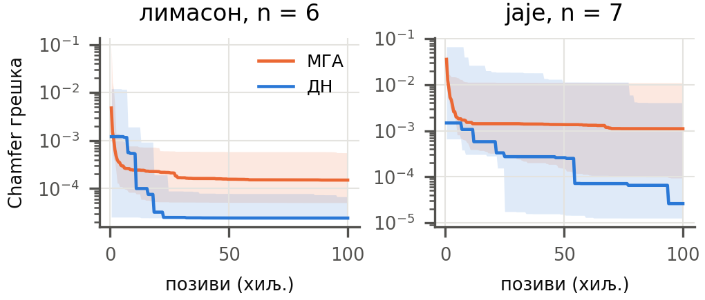

# Увод

Механизам са полугама претвара равномерно окретање осовине у сложено кретање неке своје тачке; најпознатији пример је нога Jansen-овог *Strandbeest*-а, до које је аутор стигао дугим ручно вођеним поступком. Питање овог рада: ако је задата затворена крива, може ли рачунар сам да пронађе механизам чија спрежна тачка (*трагач*) ту криву исцртава?

Решење има две природе — **топологију** (који је зглоб окачен о које) и **геометрију** (положаје зглобова и дужине полуга) — јако спрегнуте: иста геометријска промена у једној топологији поправља путању, у другој је руши. Уз то већина комбинација није изводљива. Класична синтеза користи еволутивне алгоритме над унапред фиксираном топологијом, најчешће четворополужјем [@cabrera; @sleesongsom], а новији приступи претражују унапред израчунате базе механизама [@link; @tang]; оба правца заобилазе истовремену претрагу топологије и геометрије.

Са стране оптимизације, проблем припада класи мешовите оптимизације црне кутије: тражи се $\min f(c,x)$, где је $c$ вектор категоричких променљивих без поретка, а $x$ реални вектор. Методи попут CatCMA [@catcma] држе производ-расподелу над $c$ и $x$ и тиме претпостављају независност. Ong, Shirakawa и Akimoto [@igbd] уместо тога цепају проблем на два нивоа,
$$
f^*(c) = \min_x f(c,x), \qquad \min_{q}\; \mathbb{E}_{c \sim \mathrm{Cat}(q)}\big[f^*(c)\big],
$$
и показују да на функцијама са јаком спрегом та подела надмашује CatCMA и ICatCMA. Мере је на вештачким функцијама, са бинарним категоричким променљивим и **фиксним** $d_c$ и $d_x$, и сами наводе да вишеопционе категоричке променљиве остају нетестиране.

Синтеза механизама са променљивим бројем зглобова излази из тог оквира, јер број чворова мења и $d_c$ и $d_x$. Рад има два циља: (1) **пренос** — показати да је синтеза пантографа при фиксном $n$ инстанца њихове класе проблема и да препорука која из тог рада следи даје предност и на стварном задатку; (2) **проширење** — да двонивовска подела са популацијским спољашњим нивоом ради и када се број чворова мења током претраге.

**Хипотеза H1.** При истом буџету позива симулатора двонивовски метод (генетски алгоритам над топологијом + ЦМА-ЕС над геометријом) даје нижу коначну грешку од монолитног генетског алгоритма који топологију и геометрију мења заједно. Хипотеза се одбацује ако интервал поверења медијане односа грешака обухвати 1. Брзина конвергенције се извештава као резултат уз хипотезу, не као део тврдње.

# Проблем и пресликавање

## Механизам и секвенца склапања

Механизам је граф са $n$ зглобова и $|E| = 2n-5$ крутих полуга, што за раван систем са два непокретна зглоба даје тачно један степен слободе. Улоге одређује индекс: чворови 0 и 1 су непокретни током обртаја (чвор 0 у координатном почетку, чвор 1 на положају који јесте пројектна променљива), чвор 2 је ручица, а чвор $n-1$ трагач.

Скуп ивица не каже ко на кога виси, па механизам записујемо као **секвенцу склапања**: језгро (чворови 0, 1, 2) и за сваки следећи чвор $k = 3,\dots,n-1$ ген
$$
g_k = \big(a_k,\; b_k,\; \rho^a_k,\; \rho^b_k,\; s_k\big),
$$
где су $a_k < b_k < k$ два већ постављена ослонца, $\rho$ дужине двеју нових полуга изражене као однос према размаку ослонаца у почетном положају, а $s_k \in \{-1,+1\}$ бира једну од две тачке пресека кругова. Сваки чвор тако има тачно два суседа мањег индекса, па је редослед решавања увек $[3,\dots,n-1]$: запис једнозначно одређује механизам. Обрнуто не важи — мртав терет и међусобно независни чворови дају више записа за исти механизам.

Путања трагача зависи само од чворова његовог **предачког стабла**; остали (*мртав терет*) не утичу на путању, али остају у геному као материјал за касније мутације.

## Симулација, изводљивост и грешка

Положај сваког чвора за угао ручице рачуна се пресеком два круга око његових ослонаца; путања се узоркује у $N = 720$ углова. Грана пресека $s_k$ одређује се једном, у почетном положају, и важи на сваком углу — прелазак на другу грану захтевао би пролаз кроз мртву тачку, коју праг угла преноса одбија, па је путања непрекидна по конструкцији.

Јединка је **неизводљива** ако у било ком углу кругови немају пресек, ако угао преноса (мерен као одступање од мртве тачке) падне испод $10^\circ$ [@balli], или ако однос најдуже полуге и полупречника путање пређе 5.0. Неизводљива јединка добија равну казну $10^9$; ранг-базирани методи на том платоу немају градијент, што је разлика у односу на технике руковања ограничењима какву описују Sleesongsom и Bureerat [@sleesongsom].

Циљна крива и генерисана путања нормализују се истом функцијом (центар обухватног правоугаоника у координатни почетак, највеће растојање од центра 1), па грешка мери искључиво облик. Грешка је симетрично Chamfer растојање $d(G,T) = \frac{1}{N}\sum_{i}\min_j \lVert g_i - t_j\rVert^2 + \frac{1}{m}\sum_{j}\min_i \lVert t_j - g_i\rVert^2$.

## Пресликавање на $\min f(c,x)$

За фиксно $n$ секвенца се дословно раставља: категорички део $c$ чине, за сваки $k$, неуређени пар ослонаца са $\binom{k}{2}$ опција и знак гране са две, дакле $d_c = 2(n-3)$ и $|\mathcal{C}| = \prod_k 2\binom{k}{2}$; континуални део је $x = (q_{1x},q_{1y},q_{2x},q_{2y},\rho^a_3,\rho^b_3,\dots) \in \mathbb{R}^{2n-2}$. За $n = 6, 7, 8$ то даје $d_c = 6, 8, 10$, $d_x = 10, 12, 14$ и $|\mathcal{C}| = 1\,440$, $43\,200$ и $1\,814\,400$, уз до 21 опцију по категоричкој променљивој. Величина $|\mathcal{C}|$ броји записе, не различите механизме — мртав чвор на позицији $k$ сажима фактор $2\binom{k}{2}$.

Растављање омогућава баш секвенца склапања: са записом преко скупа ивица простор не би био производ појединачних избора. Континуални део има исту димензију $2n-2$ као и геном монолитног метода, па оба метода претражују простор исте величине.


# Методе

**Монолитни генетски алгоритам (МГА)** мења топологију и геометрију у истом кораку. То је стандардан ГА по узору на Cabrera и сар. [@cabrera]: популација 100, елитних 20% непромењено, остатак укрштањем (рез секвенце склапања) уз тополошку (0.30) и координатну мутацију (0.70). Координатна мутација додаје чворовима изотропни Гаусов шум ширине сразмерне просечној дужини полуге, са коефицијентом који опада од 0.15 до 0.02 по уделу потрошеног буџета.

**Двонивовски метод (ДН)** цепа исту секвенцу по горњем пресликавању. Спољашњи ниво је генетски алгоритам са 20 скелета: најбоља четири прелазе даље са својим живим стањем ЦМА-ЕС-а, а 16 нових настаје тополошком мутацијом родитеља из горње половине; укрштања нема. Унутрашњи ниво је ЦМА-ЕС [@hansen] са пуном коваријансном матрицом над $x$, са динамичким бројем итерација. Три ствари га прилагођавају проблему: мртви чворови не заузимају димензије вектора; дете почиње од најбоље тачке родитеља и наслеђује дијагоналу његове ширине расподеле [@nomura]; знак гране припада топологији, не вектору.

Тополошки оператори су заједнички за оба метода: при променљивом $n$ додавање и брисање чвора уз $n \in [4,12]$, а при фиксном $n$ преповезивање — замена једног ослонца (0.70) или обртање знака гране (0.30).

**Јединица трошка** је један позив симулатора — једна оцена једног кандидата, код МГА једна јединка, код ДН свака тачка коју ЦМА-ЕС узоркује, укључујући оне које падну већ на реконструкцији. Исто бројање користе Ong и сар. [@igbd]. Скелет који прође структурну проверу, а чија је путања дегенерисана током обртаја, ипак добија ЦМА-ЕС и троши позиве док се плато не напуни; удео буџета који одлази на такве скелете је значајан и биће засебно измерен.

**Поставка.** Сва покретања иду у режиму поређења: резолуција фиксно $N = 720$, буџет 100 000 позива за оба метода, без раног заустављања, уз запис најбоље грешке на решетки од 500 позива. Кеш оцене непромењене елите код МГА уштеди 24 980 позива (25%), тј. МГА оцени око 125 000 јединки за номиналних 100 000 — то иде у корист монолитног метода и чини поређење конзервативним. Циљне криве су шест аналитичких затворених кривих без самопресека (круг, елипса, јаје, лимасон, Касинијев овал, суперелипса), у 720 тачака. Круг је под пуном скалном инваријантношћу дегенерисан — кружна путања било ког полупречника савршено га погађа — и изостављен је из свих бројева.

Експеримент **Е1** (фиксно $n \in \{6,7,8\}$) је пренос, **Е2** (променљиво $n$) проширење; свака ћелија је крива × поставка, са шест seed-ова (пет за $n=7$, где је једно покретање изгубљено и није поновљено), укупно 242 покретања. Токови случајних бројева раздвојени су по улози, а ЦМА-ЕС сваког скелета добија ток изведен из тројке (seed, генерација, место у популацији); свако покретање бележи комит кода.

**Статистичка обрада.** Грешке се пружају кроз десет редова величине, па се сва поређења раде над $\log_{10}$ грешке. Примарни тест је Вилкоксонов упарени тест ранга [@wilcoxon] над **двадесет ћелија** (крива × поставка), где је вредност ћелије разлика медијана $\log_{10}$ грешке двају метода. Ћелија је узета као јединица јер поређење унутар ње дели циљну криву и поставку, док упаривање по броју seed-а не носи заједнички извор шума: исти seed даје монолитном методу 100 почетних генома, а двонивовском 20 записа. Интервал медијане добија се bootstrap-ом преко ћелија (10 000 узорака) [@efron]. Поставке се приказују описно, медијаном и распоном својих пет ћелија; формални тест иде над свих двадесет.

# Резултати

Табела \ref{tab:glavno} даје главни резултат. Преко свих двадесет ћелија медијана односа је **0.62×** (95% интервал 0.40–0.76), Вилкоксонов упарени тест даје $p = 1.0\cdot10^{-4}$, а двонивовски метод је бољи у 18 од 20 ћелија и у 89 од 115 појединачних парова. Предност постоји у све четири поставке, али не подједнако: медијана по ћелијама најслабија је на $n = 6$ (0.82×), а једна ћелија иде у корист монолитног метода на $n = 7$ (Касинијев овал, 1.54×).

```{=latex}
\begin{table}[t]
\caption{Поређење коначних грешака по ћелијама (крива $\times$ поставка), без круга. Однос {<}1 значи да је ДН бољи.}
\label{tab:glavno}
\centering
\begin{tabular}{@{}lccc@{}}
\toprule
поставка & ћелија за ДН & медијана & распон по ћелијама \\
\midrule
Е1, $n=6$ & 5/5 & 0.82$\times$ & 0.18--0.97 \\
Е1, $n=7$ & 4/5 & 0.34$\times$ & 0.02--1.54 \\
Е1, $n=8$ & 4/5 & 0.68$\times$ & 0.07--1.01 \\
Е2 & 5/5 & 0.56$\times$ & 0.32--0.72 \\
\midrule
\textbf{све} & \textbf{18/20} & \textbf{0.62}$\times$ & \textbf{95\% 0.40--0.76} \\
\bottomrule
\end{tabular}
\end{table}
```

Тренд по величини проблема није монотон (0.82× / 0.34× / 0.68× за $n = 6/7/8$): предност постоји на све три величине, али не расте нити опада са $n$.

{width=98%}


**Брзина.** Преко свих 115 парова, уз цензурисање на пун буџет тамо где никад не достигне, ДН достиже коначну грешку МГА на медијално **24.5%** буџета, а у 69% парова на мање од половине; у обрнутом смеру МГА достиже резултат ДН у само 26 од 115 парова. Слика \ref{fig:konv} показује и облик: ДН напредује степенасто — равни делови се прекидају кад се појави топологија чију геометрију ЦМА-ЕС уме да одведе ниже — док МГА брзо пада у првих неколико хиљада позива, а затим споро.

**Физичка исправност.** Медијана најмањег угла преноса је $10.5^\circ$ за МГА и $10.8^\circ$ за ДН, медијана гломазности 4.50 наспрам 4.25, а прекида путање нема ни у једном од 230 анализираних покретања: предност у грешци није купљена гором изводљивошћу. Обе границе су активне — две трећине решења има угао преноса између $10^\circ$ и $15^\circ$, половина гломазност изнад 4.5 при граници 5.0. При фиксном $n$ ДН побеђује са мање радних чворова (5–6 наспрам 6–7).

**Граница метода.** Тежина појединачног покретања не предвиђа добитак (Спирман $-0.01$, пермутациони $p = 0.94$). Али две криве на којима ДН нема јасну предност — Касинијев овал и суперелипса — једине су на којима ниједно од 46 покретања није сишло испод $4\cdot10^{-4}$, уз распон свих резултата од 6–18×: при датом $n$ оба метода стижу до истог пода, који зависи од $n$ (на суперелипси $3.5\cdot10^{-3}$ при $n=6$, $2.0\cdot10^{-3}$ при $n=8$). Тај под даје и мерило величине ефекта: цео додатни чвор вреди 1.75×, па је 0.62× по том мерилу крупан помак. Ту се види вредност проширења: у Е2 ДН сам расте до 9 радних чворова и стиже до $2.1\cdot10^{-3}$, док МГА остаје на 5.5 радних чворова и $3.6\cdot10^{-3}$ — предност није бољи оптимум при истом $n$, него бољи избор величине механизма.

# Дискусија

**У који тип интеракције спада проблем.** Ong и сар. [@igbd] разликују четири типа утицаја категоричког дела на континуални: маскирање активних компоненти (I), померање оптимума (II), обоје (III) и промену метрике, тј. структуре спреге међу компонентама $x$ (IV, њихов допринос). Код нас скелет одређује предачко стабло, дакле које компоненте $x$ утичу на путању — при $n=8$ раде свих осам чворова у само 25.5% генерација — што је тип I по конструкцији; они наводе да тип I тражи посебан третман у доњем нивоу, а наш јесте изостављање мртвих димензија. Промена ослонца или знака мења значење сваке компоненте низводних чворова — тип II. Проблем је најмање тип III.

За тип IV мерили смо Хесијан по $x$ у решењима 25 покретања: удео енергије ван дијагонале је 0.52–0.93 (медијана 0.78), дакле пејзаж је свуда јако нераздвојив — независан аргумент за унутрашњи метод са пуном коваријансом; највећа сопствена вредност варира до 26.6× **унутар исте циљне криве** ($r = +0.43$ са дубином ланца). Јака спрега је утврђена; да скелет мења метрику — поткрепљено, али не доказано, јер скелети нису бирани него затечени, па су $n$, крива и дубина измешани.

**Поређење не изолује механизам предности.** Поређење мења две ствари истовремено: поделу претраге на нивое и избор унутрашњег оптимизатора, па допринос сваке од њих остаје неизмерен. Монолитна контрола са пуном коваријансом није изводљива, јер у монолитном запису вектор геометрије мења значење при свакој тополошкој мутацији — исти број у $\rho$ описује другу полугу, а при додавању чвора мења се и димензија — док учење коваријансе претпоставља координате сталног значења. Два метода раздвајају оно што ово поређење спаја: CatCMA изолује допринос поделе, јер пуну коваријансу задржава над заједничком расподелом, а IGBD изолује облик спољашњег нивоа, јер поделу задржава а спољашњи ниво мења у расподелу. За CatCMA аргумент предвиђа слаб резултат баш овде, јер производ-расподела претпоставља независност коју измерена ван-дијагонална енергија Хесијана од 0.78 не подржава.


Предност се појављује под три околности којих у њиховим тест-функцијама нема: вишеопционе категоричке променљиве (до 21 опције), неизводљивост са платоом казне, и буџет од $10^5$ позива наспрам $2\cdot10^4 d_c d_x$ колико прописује њихов протокол (за $n=8$ 28 пута мање).

**Ограничења.** Шест seed-ова по ћелији (пет за $n=7$) наспрам двадесет у референтном раду, и једна класа циљних кривих. У Е2 координатна мутација монолитног метода погађа и чворове ван предачког стабла (медијално 8.5 чворова наспрам 5 радних), који по конструкцији не могу да промене фитнес, док их двонивовски метод изоставља из вектора; та асиметрија иде у корист двонивовског метода и највероватније надувава резултат Е2, док Е1, где мртвог терета готово да нема, њоме није захваћен. Мерења Хесијана рађена су на решењима из раније серије покретања, под профилом са раним заустављањем. Део матрице урађен је пре поправке симулатора код готово-нулте полуге; сваки лог носи свој комит.

# Закључак

Синтеза пантографских механизама, записана као секвенца склапања, при фиксном броју чворова је тачна инстанца мешовитог проблема $\min f(c,x)$ из рада Ong, Shirakawa и Akimoto. На том проблему двонивовски метод при истом буџету даје нижу грешку од монолитног у 18 од 20 ћелија (медијана 0.62×), до резултата монолитног метода долази на четвртини буџета, без губитка физичке изводљивости и са мање радних чворова. Предност опстаје и при променљивом броју чворова, где оквир из референце не важи, и тамо метод сам бира величину механизма коју крива захтева. Предност нестаје тамо где оба метода при датом броју чворова стигну до границе саме фамилије механизама.

Наставак: CatCMA и IGBD као трећа и четврта тачка поређења, што једино раздваја допринос поделе од доприноса унутрашњег оптимизатора; циљна крива са познатим решењем, која под грешке чини нулом по конструкцији; контролисан низ скелета, који затвара питање типа IV; и тежи циљеви — слова и Јансенова крива.

Код, логови свих покретања и тачне команде којима је матрица пуштена налазе се на `github.com/najkela/generisanje-pantografskih-sistema`, ознака `rad-v1`.
